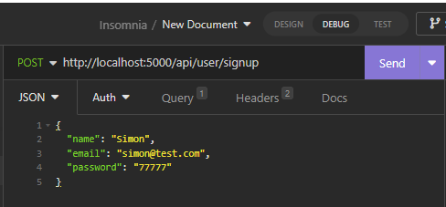

## Social Network API

## Description
This is an API for a social network web application where users can share their thoughts, react to friends' thoughts, and manage their friend list. The application is built using Express.js and Mongoose, making use of a NoSQL database to handle large amounts of unstructured data. This API was developed without starter code, and the data was inserted using MongoDB Compass.

## User Story
As a social media startup, I want an API for my social network that uses a NoSQL database, so that my website can handle large amounts of unstructured data.

## Acceptance Criteria

When the command to invoke the application is entered, the server starts, and the Mongoose models are synced to the MongoDB database.
API GET routes for users and thoughts display the data in formatted JSON when accessed in Insomnia.
API POST, PUT, and DELETE routes in Insomnia allow successful creation, updating, and deletion of users and thoughts in the database.
API POST and DELETE routes in Insomnia allow successful creation and deletion of reactions to thoughts, as well as adding and removing friends to a user's friend list.

## Installation

To run this application, you need the following downloads:

Visual Studio Code
Node.js
Insomnia
MongoDB Compass
Additionally, the following Node Package Manager modules are required:

Express
Mongoose

## Demo

